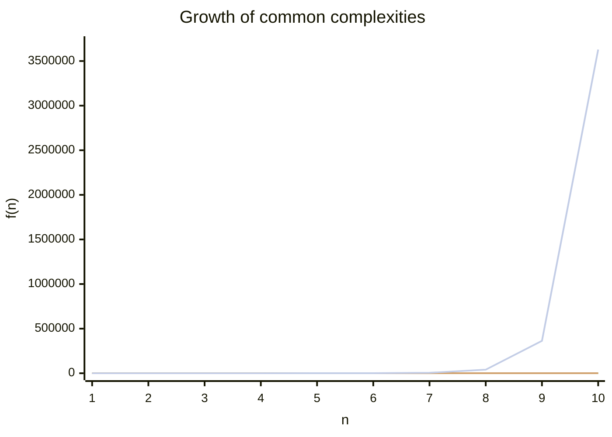

## Big-O Comparison Cheatsheet

This section visualizes common time complexity classes to compare their growth as n increases.

### Mermaid chart (renders in GitHub/VS Code)



Notes:
- Values are illustrative (rounded) for comparison; constants are ignored in Big-O.
- y-axis uses raw values to show separation; O(n!) explodes rapidly.

### Quick reference

- O(1): Hash table access, push/pop on stack
- O(log n): Binary search, balanced BST operations
- O(n): Linear scan, finding max/min
- O(n log n): Efficient sorts (merge/quick average), heap operations over n items
- O(n^2): Bubble/selection/insertion sort (worst/avg), pairwise comparisons
- O(2^n): Brute-force subsets, naive recursion for Fibonacci
- O(n!): Traveling Salesman brute-force permutations

### PNG chart (optional)

If your platform doesn’t render Mermaid, you can generate a PNG via a small Python script (see `scripts/big_o_chart.py`) and view it at `assets/big_o_growth.png`.

Generate locally:

1) Ensure Python 3 is available and install matplotlib
2) Run the script to create the image

Commands (macOS, zsh):

```bash
python3 -m pip install --user matplotlib
python3 scripts/big_o_chart.py
open assets/big_o_growth.png
```

Embedded image (will appear after you generate it):


