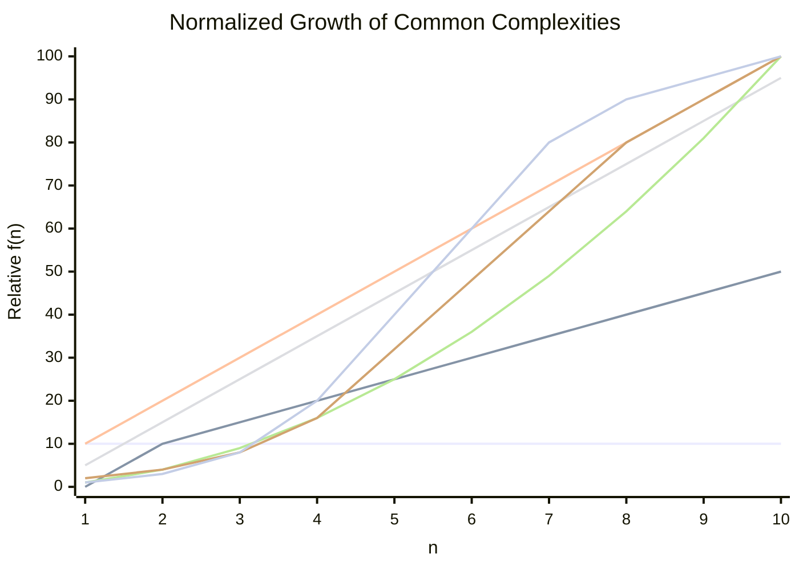

## Big-O Comparison Cheatsheet

This section visualizes common time complexity classes to compare their growth as n increases.

### Mermaid chart (renders in GitHub/VS Code)



Notes:
- Values are illustrative (rounded) for comparison; constants are ignored in Big-O.
- y-axis uses raw values to show separation; O(n!) explodes rapidly.

### Quick reference

- O(1): Hash table access, push/pop on stack
- O(log n): Binary search, balanced BST operations
- O(n): Linear scan, finding max/min
- O(n log n): Efficient sorts (merge/quick average), heap operations over n items
- O(n^2): Bubble/selection/insertion sort (worst/avg), pairwise comparisons
- O(2^n): Brute-force subsets, naive recursion for Fibonacci
- O(n!): Traveling Salesman brute-force permutations

### PNG chart (optional)

If your platform doesn’t render Mermaid, you can generate a PNG via a small Python script (see `scripts/big_o_chart.py`) and view it at `assets/big_o_growth.png`.

Generate locally:

1) Ensure Python 3 is available and install matplotlib
2) Run the script to create the image

Commands (macOS, zsh):

```bash
python3 -m pip install --user matplotlib
python3 scripts/big_o_chart.py
open assets/big_o_growth.png
```

Embedded image (will appear after you generate it):


---


⚙️ Python List — Time Complexity Table
---


| Operation                | Example                              | Average Case         | Worst Case     | Explanation                                               |
| ------------------------ | ------------------------------------ | -------------------- | -------------- | --------------------------------------------------------- |
| **Indexing (access)**    | `lst[i]`                             | **O(1)**             | **O(1)**       | Direct access via memory offset.                          |
| **Assign by index**      | `lst[i] = x`                         | **O(1)**             | **O(1)**       | Direct memory access.                                     |
| **Append**               | `lst.append(x)`                      | **O(1)** (amortized) | **O(n)**       | Usually O(1), but occasionally needs to resize the array. |
| **Pop (last)**           | `lst.pop()`                          | **O(1)**             | **O(1)**       | Removes from end — no shifting needed.                    |
| **Pop (from i)**         | `lst.pop(i)`                         | **O(n)**             | **O(n)**       | Shifts elements after index `i` left by one.              |
| **Insert**               | `lst.insert(i, x)`                   | **O(n)**             | **O(n)**       | Shifts all elements from index `i` onward.                |
| **Delete (by index)**    | `del lst[i]`                         | **O(n)**             | **O(n)**       | Shifts all elements left after deletion.                  |
| **Remove (by value)**    | `lst.remove(x)`                      | **O(n)**             | **O(n)**       | Linear search to find `x`, then shifts elements.          |
| **Iteration**            | `for x in lst:`                      | **O(n)**             | **O(n)**       | Visits every element once.                                |
| **Membership check**     | `x in lst`                           | **O(n)**             | **O(n)**       | Linear scan required.                                     |
| **Copy (shallow)**       | `lst.copy()`                         | **O(n)**             | **O(n)**       | Copies all elements to a new list.                        |
| **Slice (create new)**   | `lst[a:b]`                           | **O(k)**             | **O(k)**       | Copies `k = b−a` elements into new list.                  |
| **Extend / Concatenate** | `lst1 + lst2` or `lst1.extend(lst2)` | **O(k)**             | **O(k)**       | Adds all `k` elements of second list.                     |
| **Sort**                 | `lst.sort()`                         | **O(n log n)**       | **O(n log n)** | Timsort algorithm used (hybrid merge + insertion).        |
| **Min / Max**            | `min(lst)` / `max(lst)`              | **O(n)**             | **O(n)**       | Scans all elements.                                       |
| **Sum**                  | `sum(lst)`                           | **O(n)**             | **O(n)**       | Adds all elements sequentially.                           |
| **Reversal (in place)**  | `lst.reverse()`                      | **O(n)**             | **O(n)**       | Swaps all pairs.                                          |
| **Count occurrences**    | `lst.count(x)`                       | **O(n)**             | **O(n)**       | Scans entire list.                                        |
| **Clear**                | `lst.clear()`                        | **O(1)**             | **O(1)**       | Just resets internal pointer (deallocates).               |


🧩 Dictionary Operations and Their Time Complexities
---

| **Operation**                      | **Example**                | **Average Case** | **Worst Case** | **Explanation**                                                    |
| ---------------------------------- | -------------------------- | ---------------- | -------------- | ------------------------------------------------------------------ |
| **Create empty dict**              | `d = {}`                   | **O(1)**         | **O(1)**       | Creates an empty hash table.                                       |
| **Insert / Update key-value pair** | `d[k] = v`                 | **O(1)**         | **O(n)**       | Hash lookup + insert; worst case occurs when many keys collide.    |
| **Access / Lookup value by key**   | `d[k]`                     | **O(1)**         | **O(n)**       | Hash lookup; worst case if hash collisions cause linear scan.      |
| **Check key existence**            | `k in d`                   | **O(1)**         | **O(n)**       | Uses hash lookup (same as access).                                 |
| **Delete key**                     | `del d[k]`                 | **O(1)**         | **O(n)**       | Removes entry from hash table; worst if rehash or collision chain. |
| **Get value with default**         | `d.get(k, default)`        | **O(1)**         | **O(n)**       | Same as access with safe fallback.                                 |
| **Set default**                    | `d.setdefault(k, default)` | **O(1)**         | **O(n)**       | Adds key if missing; otherwise returns existing value.             |
| **Pop key**                        | `d.pop(k)`                 | **O(1)**         | **O(n)**       | Removes and returns key; rehashing or collisions may degrade.      |
| **Pop arbitrary item**             | `d.popitem()`              | **O(1)**         | **O(1)**       | Removes last inserted item (since Python 3.7+ maintains order).    |
| **Iterate over keys**              | `for k in d:`              | **O(n)**         | **O(n)**       | Visits all keys once.                                              |
| **Iterate over values**            | `for v in d.values():`     | **O(n)**         | **O(n)**       | Visits all values once.                                            |
| **Iterate over items**             | `for k,v in d.items():`    | **O(n)**         | **O(n)**       | Visits all key-value pairs.                                        |
| **Copy dictionary**                | `d.copy()`                 | **O(n)**         | **O(n)**       | Creates shallow copy.                                              |
| **Clear dictionary**               | `d.clear()`                | **O(1)**         | **O(1)**       | Resets internal table pointer (deallocates all entries).           |
| **len(d)**                         | `len(d)`                   | **O(1)**         | **O(1)**       | Stores size as internal counter.                                   |
| **Merge two dicts**                | `d1.update(d2)`            | **O(m)**         | **O(m)**       | Inserts `m` items from `d2` into `d1`.                             |


⚙️ Python Tuple Time Complexity Table
---

| **Operation**          | **Example / Description** | **Time Complexity** | **Explanation**                                                                   |
| ---------------------- | ------------------------- | ------------------- | --------------------------------------------------------------------------------- |
| **Indexing**           | `t[i]`                    | **O(1)**            | Direct access using memory offset (tuples store elements contiguously in memory). |
| **Length**             | `len(t)`                  | **O(1)**            | Length is stored internally; no iteration needed.                                 |
| **Iteration**          | `for x in t:`             | **O(n)**            | Each element must be visited once.                                                |
| **Slicing**            | `t[a:b]`                  | **O(k)**            | Copies `k` sliced elements into a new tuple.                                      |
| **Concatenation**      | `t1 + t2`                 | **O(n + m)**        | Creates a new tuple with all elements copied.                                     |
| **Repetition**         | `t * k`                   | **O(n * k)**        | Creates a new tuple by repeating the original elements.                           |
| **Membership Test**    | `x in t`                  | **O(n)**            | Must scan sequentially (no hashing like in sets).                                 |
| **Min / Max**          | `min(t)` / `max(t)`       | **O(n)**            | Must iterate to find smallest/largest element.                                    |
| **Sum**                | `sum(t)`                  | **O(n)**            | Iterates over all elements to compute total.                                      |
| **Count**              | `t.count(x)`              | **O(n)**            | Scans all elements to count occurrences.                                          |
| **Index (search)**     | `t.index(x)`              | **O(n)**            | Linear search for the first match.                                                |
| **Equality Check**     | `t1 == t2`                | **O(n)**            | Compares element-by-element until a difference is found.                          |
| **Copy (Shallow)**     | `t_copy = t`              | **O(1)**            | Both names point to same tuple (immutable).                                       |
| **Conversion to List** | `list(t)`                 | **O(n)**            | Creates and copies elements into a new list.                                      |
| **Hashing**            | `hash(t)`                 | **O(n)**            | Computes hash using each element (cached for reuse).                              |

🧮 Python Set Time Complexity Table
---

| **Operation**            | **Example**                            | **Average Case**           | **Worst Case**         | **Explanation**                                                                    |                     |
| ------------------------ | -------------------------------------- | -------------------------- | ---------------------- | ---------------------------------------------------------------------------------- | ------------------- |
| **Create empty set**     | `s = set()`                            | **O(1)**                   | **O(1)**               | Simple object allocation.                                                          |                     |
| **Add element**          | `s.add(x)`                             | **O(1)**                   | **O(n)**               | Average O(1) due to hash table; may resize if load factor exceeded.                |                     |
| **Remove element**       | `s.remove(x)`                          | **O(1)**                   | **O(n)**               | O(1) average; O(n) if hash collisions or resizing. Raises `KeyError` if not found. |                     |
| **Discard element**      | `s.discard(x)`                         | **O(1)**                   | **O(n)**               | Same as remove, but no error if missing.                                           |                     |
| **Check membership**     | `x in s`                               | **O(1)**                   | **O(n)**               | Hash lookup — constant on average.                                                 |                     |
| **Pop element**          | `s.pop()`                              | **O(1)**                   | **O(n)**               | Removes arbitrary element; O(1) amortized.                                         |                     |
| **Clear all elements**   | `s.clear()`                            | **O(1)**                   | **O(1)**               | Just resets internal hash table.                                                   |                     |
| **Copy set**             | `s.copy()`                             | **O(n)**                   | **O(n)**               | Must iterate over all elements.                                                    |                     |
| **Set length**           | `len(s)`                               | **O(1)**                   | **O(1)**               | Size stored internally.                                                            |                     |
| **Iterate over set**     | `for x in s:`                          | **O(n)**                   | **O(n)**               | Visits all elements once.                                                          |                     |
| **Union**                | `s                                     | t`or`s.union(t)`           | **O(len(s) + len(t))** | **O(len(s) + len(t))**                                                             | Combines both sets. |
| **Intersection**         | `s & t` or `s.intersection(t)`         | **O(min(len(s), len(t)))** | **O(len(s) * len(t))** | Iterates through smaller set checking membership.                                  |                     |
| **Difference**           | `s - t` or `s.difference(t)`           | **O(len(s))**              | **O(len(s) + len(t))** | Iterates through `s` checking membership in `t`.                                   |                     |
| **Symmetric Difference** | `s ^ t` or `s.symmetric_difference(t)` | **O(len(s) + len(t))**     | **O(len(s) + len(t))** | Combines both and removes common elements.                                         |                     |
| **Subset check**         | `s <= t` or `s.issubset(t)`            | **O(len(s))**              | **O(len(s) * len(t))** | Checks each element of `s` in `t`.                                                 |                     |
| **Superset check**       | `s >= t` or `s.issuperset(t)`          | **O(len(t))**              | **O(len(s) * len(t))** | Checks each element of `t` in `s`.                                                 |                     |
| **Equality check**       | `s == t`                               | **O(len(s))**              | **O(len(s))**          | Must compare hash and elements.                                                    |                     |


🧮 Python Frozenset Time Complexity Table
---
| Operation             | Example                               |       Avg. Time |        Worst |     Extra Space | Notes                                                   |                           |
| --------------------- | ------------------------------------- | --------------: | -----------: | --------------: | ------------------------------------------------------- | ------------------------- |
| Create from iterable  | `frozenset(it)`                       |        **O(n)** |     **O(n)** |        **O(n)** | Hash table build from `it`.                             |                           |
| Length                | `len(s)`                              |        **O(1)** |     **O(1)** |               — | Stored size.                                            |                           |
| Membership            | `x in s`                              |        **O(1)** |     **O(n)** |               — | Hash lookup; worst only with many collisions.           |                           |
| Iterate               | `for x in s`                          |        **O(n)** |     **O(n)** |               — | Visits each element once.                               |                           |
| Equality / Inequality | `s == t`, `s != t`                    |        **O(n)** |     **O(n)** |               — | After quick checks (size/hash), element-wise compare.   |                           |
| Subset                | `s.issubset(t)` / `s <= t`            |        **O(n)** |   **O(n·α)** |               — | α≈collision factor; effectively **O(n)** average.       |                           |
| Proper subset         | `s < t`                               |        **O(n)** |     **O(n)** |               — | As above plus size check.                               |                           |
| Superset              | `s.issuperset(t)` / `s >= t`          |        **O(m)** |     **O(m)** |               — | Same logic, but scans the other set.                    |                           |
| Disjoint              | `s.isdisjoint(t)`                     | **O(min(n,m))** |   **O(n+m)** |               — | Early exit on first common element.                     |                           |
| Union                 | `s.union(t, …)` / `s                  |              t` | **O(n + m)** |    **O(n + m)** | **O(n + m)**                                            | Builds a new `frozenset`. |
| Intersection          | `s.intersection(t)` / `s & t`         | **O(min(n,m))** |   **O(n+m)** | **O(min(n,m))** | Probes smaller into larger.                             |                           |
| Difference            | `s.difference(t)` / `s - t`           |        **O(n)** |   **O(n+m)** |        **O(n)** | Checks each of `s` against `t`.                         |                           |
| Symmetric diff        | `s.symmetric_difference(t)` / `s ^ t` |    **O(n + m)** | **O(n + m)** |    **O(n + m)** | New `frozenset`.                                        |                           |
| Copy                  | `s.copy()`                            |        **O(1)** |     **O(1)** |        **O(1)** | Returns `s` itself (immutable).                         |                           |
| Hash of set           | `hash(s)`                             |        **O(n)** |     **O(n)** |               — | Defined so `frozenset` can be a dict key / set element. |                           |
